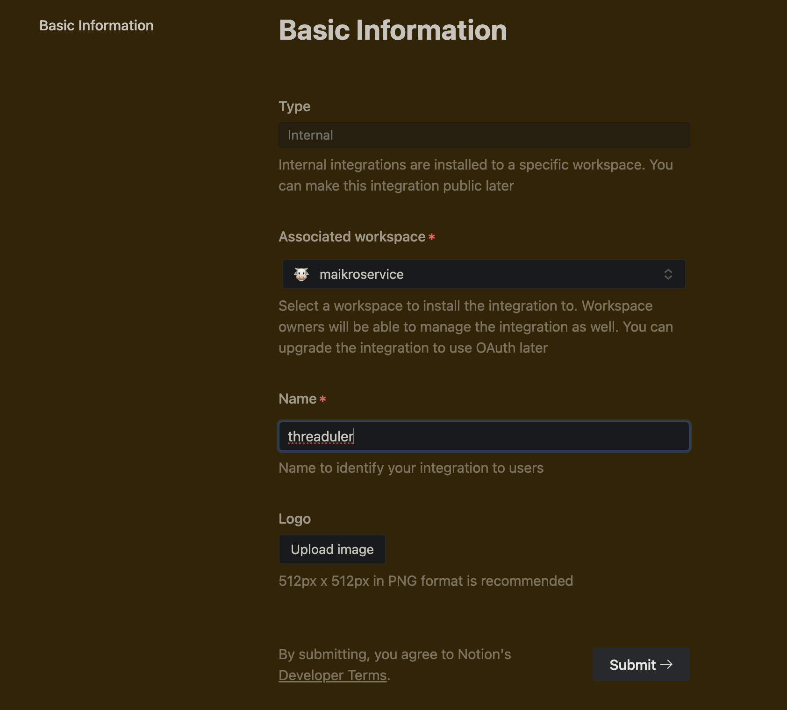
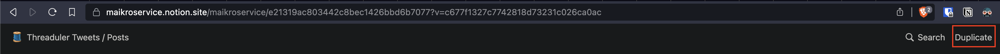
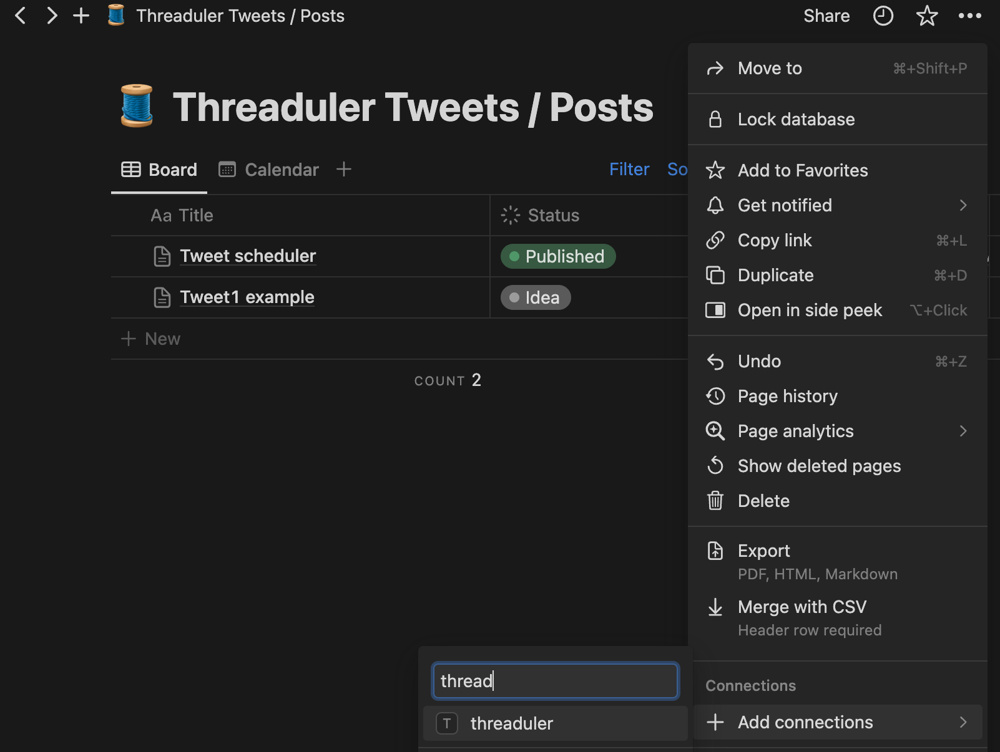

<!-- Improved compatibility of back to top link: See: https://github.com/othneildrew/Best-README-Template/pull/73 -->
<a name="readme-top"></a>
<!--
*** Thanks for checking out the Best-README-Template. If you have a suggestion
*** that would make this better, please fork the repo and create a pull request
*** or simply open an issue with the tag "enhancement".
*** Don't forget to give the project a star!
*** Thanks again! Now go create something AMAZING! :D
-->


<!-- PROJECT SHIELDS -->
<!--
*** I'm using markdown "reference style" links for readability.
*** Reference links are enclosed in brackets [ ] instead of parentheses ( ).
*** See the bottom of this document for the declaration of the reference variables
*** for contributors-url, forks-url, etc. This is an optional, concise syntax you may use.
*** https://www.markdownguide.org/basic-syntax/#reference-style-links
-->
[![Contributors][contributors-shield]][contributors-url]
[![Forks][forks-shield]][forks-url]
[![Stargazers][stars-shield]][stars-url]
[![Issues][issues-shield]][issues-url]
[![MIT License][license-shield]][license-url]
[![LinkedIn][linkedin-shield]][linkedin-url]


<!-- PROJECT LOGO -->
<br />
<div align="center">
  <a href="https://github.com/othneildrew/Best-README-Template">
    
  </a>

  <h3 align="center">Threaduler 0.1 alpha - Your open-source Social Media scheduler</h3>

  <p align="center">
    Currently Threaduler works for <a href="https://x.com">twitter/X</a>, <a href="https://bsky.app">bluesky</a> and soon^TM <a href="https://linkedin.com">linkedin</a>
    <br /><br />
    <a href="https://github.com/maikroservice/threaduler"><strong>Explore the repository »</strong></a>
    <br />
    <br />
    <a href="https://github.com/maikroservice/threaduler/issues">Report Bug</a>
    ·
    <a href="https://github.com/maikroservice/threaduler/issues">Request Feature</a>
  </p>
</div>


<!-- TABLE OF CONTENTS -->
<details>
  <summary>Table of Contents</summary>
  <ol>
    <li>
      <a href="#about-the-project">About The Project</a>
    </li>
    <li>
      <a href="#getting-started">Getting Started</a>
      <ul>
        <li><a href="#prerequisites">Prerequisites</a></li>
        <li><a href="#installation">Installation</a></li>
      </ul>
    </li>
    <li><a href="#usage">Usage</a></li>
    <li><a href="#roadmap">Roadmap</a></li>
    <li><a href="#contributing">Contributing</a></li>
    <li><a href="#license">License</a></li>
    <li><a href="#contact">Contact</a></li>
    <li><a href="#acknowledgments">Acknowledgments</a></li>
  </ol>
</details>


<!-- ABOUT THE PROJECT -->
## About The Project

Threaduler aims to solve a pain many content creators have - sharing their content while they sleep and ideally post similar content on multiple platforms. 
The driver for threaduler is <a href="https://affiliate.notion.so/9g9spozmmpsx">notion</a>, it stores the content and the meta information necessary to publish the posts. 
The project is currently in alpha - it works.
BUT during the development of a stable future version some hickups will (most likely) happen. 

You may also suggest changes by forking this repo and creating a pull request or opening an issue. Thanks to all the people have contributed to expanding this template!


<p align="right">(<a href="#readme-top">back to top</a>)</p>


<!-- GETTING STARTED -->
## Getting Started

To get a local copy up and running follow these example steps.

### Prerequisites

This is an example of how to list things you need to use the software and how to install them.
<ol>
<li>
Install poetry - <a href="https://python-poetry.org/docs/#installation">https://python-poetry.org/docs/#installation</a> </li>
<li>create notion integration - <a href="https://www.notion.so/my-integrations">https://www.notion.so/my-integrations</a>
<br />
<br />
</li>

<li>1. duplicate the post database <a href="https://maikroservice.notion.site/e21319ac803442c8bec1426bbd6b7077?v=c677f1327c7742818d73231c026ca0ac&pvs=4">template</a> <br />
</li></li>
<li>add integration to your notion database page <br />
</li>
</ol>

### Installation

1. Get a free Notion API Key at [https://developers.notion.com/](https://developers.notion.com/)
2. Get a free Twitter/X API Key at [https://developer.twitter.com/en](https://developer.twitter.com/en)
3. Clone the repository
   ```sh
   git clone https://github.com/maikroservice/threaduler.git
   ```
   
4. install dependencies with poetry
    ```sh
    cd threaduler
    poetry install
    ```
6. Enter your API keys in `.env`
   ```sh
   API_KEY=ENTER YOUR API KEY
   ```

<p align="right">(<a href="#readme-top">back to top</a>)</p>


<!-- USAGE EXAMPLES -->
## Usage

Use this space to show useful examples of how a project can be used. Additional screenshots, code examples and demos work well in this space. You may also link to more resources.

_For more examples, please refer to the [Documentation](https://github.com/maikroservice/threaduler/wiki)_

1. duplicate the post database [template](https://maikroservice.notion.site/e21319ac803442c8bec1426bbd6b7077?v=c677f1327c7742818d73231c026ca0ac&pvs=4)
2. use the template tweets to check out functionality such as threads, quote tweets and more.

<p align="right">(<a href="#readme-top">back to top</a>)</p>


<!-- ROADMAP -->
## Roadmap

- [ ] Add Changelog
- [ ] add bsky integration
- [ ] add sqlite database to cache/store transformed content
- [ ] refactoring to make it pretty and easily understandable
- [ ] Linkedin Support
    - [ ] OrganicPosts
    - [ ] Carousel

See the [open issues](https://github.com/maikroservice/threaduler/issues) for a full list of proposed features (and known issues).

<p align="right">(<a href="#readme-top">back to top</a>)</p>


<!-- CONTRIBUTING -->
## Contributing

Contributions are what make the open source community such an amazing place to learn, inspire, and create. Any contributions you make are **greatly appreciated**.

If you have a suggestion that would make this better, please fork the repo and create a pull request. You can also simply open an issue with the tag "enhancement".
Don't forget to give the project a star! Thanks again!

1. Fork the Project
2. Create your Feature Branch (`git checkout -b feature/AmazingFeature`)
3. Commit your Changes (`git commit -m 'Add some AmazingFeature'`)
4. Push to the Branch (`git push origin feature/AmazingFeature`)
5. Open a Pull Request

<p align="right">(<a href="#readme-top">back to top</a>)</p>


<!-- LICENSE -->
## License

Distributed under the MIT License. See `LICENSE.txt` for more information.

<p align="right">(<a href="#readme-top">back to top</a>)</p>


<!-- CONTACT -->
## Contact

Maik Ro - [@maikroservice](https://twitter.com/maikroservice)

Project Link: [https://github.com/maikroservice/threaduler](https://github.com/maikroservice/threaduler)

<p align="right">(<a href="#readme-top">back to top</a>)</p>


<!-- ACKNOWLEDGMENTS -->
## Acknowledgments

Use this space to list resources you find helpful and would like to give credit to. I've included a few of my favorites to kick things off!

* [Choose an Open Source License](https://choosealicense.com)
* [Img Shields](https://shields.io)
* [bsky posts](https://github.com/bluesky-social/atproto-website/blob/main/examples/create_bsky_post.py)
* Notion Affiliate Program <3

<p align="right">(<a href="#readme-top">back to top</a>)</p>


<!-- MARKDOWN LINKS & IMAGES -->
<!-- https://www.markdownguide.org/basic-syntax/#reference-style-links -->
[contributors-shield]: https://img.shields.io/github/contributors/maikroservice/threaduler.svg?style=for-the-badge
[contributors-url]: https://github.com/maikroservice/threaduler/graphs/contributors
[forks-shield]: https://img.shields.io/github/forks/maikroservice/threaduler.svg?style=for-the-badge
[forks-url]: https://github.com/maikroservice/threaduler/network/members
[stars-shield]: https://img.shields.io/github/stars/maikroservice/threaduler.svg?style=for-the-badge
[stars-url]: https://github.com/maikroservice/threaduler/stargazers
[issues-shield]: https://img.shields.io/github/issues/maikroservice/threaduler.svg?style=for-the-badge
[issues-url]: https://github.com/maikroservice/threaduler/issues
[license-shield]: https://img.shields.io/github/license/maikroservice/threaduler.svg?style=for-the-badge
[license-url]: https://img.shields.io/badge/license-MIT-green
[linkedin-shield]: https://img.shields.io/badge/-LinkedIn-black.svg?style=for-the-badge&logo=linkedin&colorB=555
[linkedin-url]: https://linkedin.com/in/maikroservice
